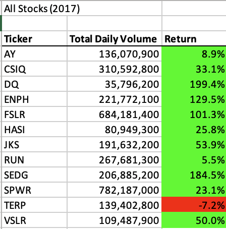
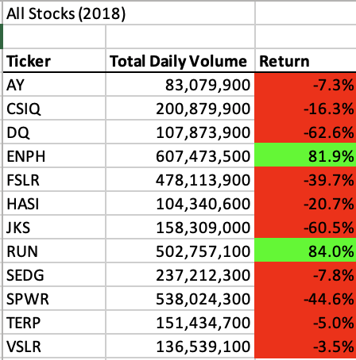
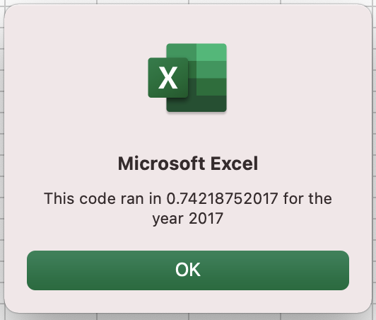
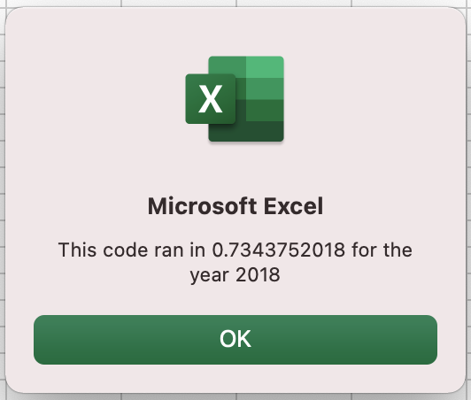
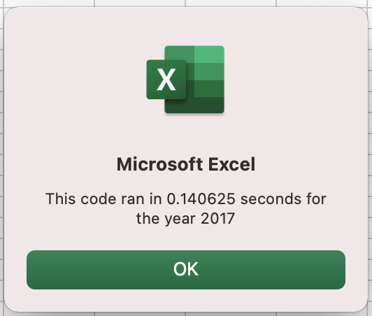
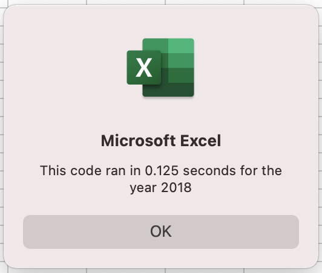

# Stocks-Analysis with VBA

## Overview of Project

In this project Steve, who is a finance degree graduate, is trying to analyze multiple of energy stocks to help his parents decide which stock is a good choice for investing their funds in by determining the total volume and percentage return of the years 2017 and 2018. As a result, VBA is going to be used for writing a code to automate analyses by interacting with excel worksheets and cells which allows Steve to reuse it for any of the 12 stocks, hence, reducing his chances of having errors.

### Purpose

The purpose of this project is to edit or refactor a previously written code that was used for performing the analysis of the stocks to help Steve expand his dataset by including the entire stock market over the past few years. This is expected to be done without adding new functionality but making the code more efficient by reducing the script into fewer steps thus, reducing the time it takes to run the code.

## Results

This section of the report focuses on the results achieved in terms of how actively the stocks were traded throughout the day and their yearly return for the years 2017 and 2018. Additionally, the execution times of both the original and the refactored scripts are going to be compared.

### Stock Performance in 2017 and 2018

As it is demonstrated in the figures below, generally the performance of stocks in the year **2017** was much better in terms of the percentage yearly return with an exception to the Sunrun Inc. that has **RUN** as their ticker which increased to **84%** in the year **2018** having the highest return comparing to the remaining stocks. 

**Stock Analysis Output of the Year 2017**

**Stock Analysis Output of the Year 2018**

Additionally, it can be seen that the company having **TERP** as their ticker had a negative return in both the years. As it is further demonstrated, it seems that no correlation exists between the total daily volume and yearly return of the stocks. For instance, Daqo New Energy Corporation, having the **DQ** as their ticker had a high percentage return of **199.4%** in 2017 while being traded 35,796,200 times, whereas in the year 2018 it had a negative yearly return of **62.6%** while being traded more by almost **72,000,000** than in 2017.  

### Original Script

The script that was written initially for determining the total daily volume and the yearly return of all the 12 stocks is shown below. As it can be seen, the original script contains a nested loop in which an inner loop is located within the body of an outer loop. The way this works is that the first pass of the first loop triggers the inner loop and then the second pass of the outer loop triggers the inner loop again and continues repeating until the outer loop is completed. Thus, this results in a higher number of iterations and increased running time.
	
	'2) Initialize an array of all tickers.
    Dim tickers(12) As String
    
    tickers(0) = "AY"
    tickers(1) = "CSIQ"
    tickers(2) = "DQ"
    tickers(3) = "ENPH"
    tickers(4) = "FSLR"
    tickers(5) = "HASI"
    tickers(6) = "JKS"
    tickers(7) = "RUN"
    tickers(8) = "SEDG"
    tickers(9) = "SPWR"
    tickers(10) = "TERP"
    tickers(11) = "VSLR"
    
    '3a) Initialize variables for the starting price and ending price.
    Dim startingPrice As Single
    Dim endingPrice As Single
    '3b) Activate the data worksheet.
    Worksheets(yearValue).Activate
    '3c) Find the number of rows to loop over.
    RowCount = Cells(Rows.Count, "A").End(xlUp).Row
    
    '4) Loop through the tickers.
    For i = 0 To 11
        ticker = tickers(i)
        totalVolume = 0
        '5) Loop through rows in the data.
        Worksheets(yearValue).Activate
        For j = 2 To RowCount
            '5a) Find the total volume for the current ticker.
             If Cells(j, 1).Value = ticker Then
    
                totalVolume = totalVolume + Cells(j, 8).Value
         
            End If
        
            '5b) Find the starting price for the current ticker.
            If Cells(j, 1).Value = ticker And Cells(j - 1, 1).Value <> ticker Then
         
                 startingPrice = Cells(j, 6).Value
    
            End If
        
             '5c) Find the ending price for the current ticker.
    
             If Cells(j, 1).Value = ticker And Cells(j + 1, 1).Value <> ticker Then
         
                 endingPrice = Cells(j, 6).Value
    
            End If
         Next j
         
        '6) Output the data for the current ticker.
        Worksheets("All Stocks Analysis").Activate
        'Creating a header row
        Cells(4 + i, 1).Value = ticker
        Cells(4 + i, 2).Value = totalVolume
        Cells(4 + i, 3).Value = (endingPrice / startingPrice) - 1

    Next i

#### Execution Time of Original Script

Figure below is showing the elapsed time in a message box which is the  time it takes for the code to get executed. As it is shown, the time it took for the original code to run the stock analysis of the year 2017 was around **0.742** seconds.

Furthermore, the time that was taken for running the code of the year 2018 stock analysis was about **0.734** seconds as depicted in the figure below.

### Refactored Script

The script shown below is the refactored script of the stock analysis. As it can be seen this script does not have the nested loops, instead the output is being taken to another separate loop, thus reducing the number of iterations unlike the original script. Thus, resulting in shorter time of execution.

	'Initialize array of all tickers
    Dim tickers(12) As String
    
    tickers(0) = "AY"
    tickers(1) = "CSIQ"
    tickers(2) = "DQ"
    tickers(3) = "ENPH"
    tickers(4) = "FSLR"
    tickers(5) = "HASI"
    tickers(6) = "JKS"
    tickers(7) = "RUN"
    tickers(8) = "SEDG"
    tickers(9) = "SPWR"
    tickers(10) = "TERP"
    tickers(11) = "VSLR"
    
    'Activate data worksheet
    Worksheets(yearValue).Activate
    
    'Get the number of rows to loop over
    RowCount = Cells(Rows.Count, "A").End(xlUp).Row
    
    '1a) Create a ticker Index
    tickerIndex = 0

    '1b) Create three output arrays
      Dim tickerVolumes(12) As Long
      Dim tickerStartingPrices(12) As Single
      Dim tickerEndingPrices(12) As Single
      
    '2a) Create a for loop to initialize the tickerVolumes to zero.
    For i = 0 To 11
    
        tickerVolumes(i) = 0
    
    Next i
    
    '2b) Loop over all the rows in the spreadsheet.
    Worksheets(yearValue).Activate
    For i = 2 To RowCount
        
        '3a) Increase volume for current ticker
        tickerVolumes(tickerIndex) = tickerVolumes(tickerIndex) + Cells(i, 8).Value
        
         '3b) Check if the current row is the first row with the selected tickerIndex.
         If Cells(i, 1).Value = tickers(tickerIndex) And Cells(i - 1, 1).Value <> tickers(tickerIndex) Then
            tickerStartingPrices(tickerIndex) = Cells(i, 6).Value
        
        End If
       
        '3c) check if the current row is the last row with the selected ticker
         'If the next row’s ticker doesn’t match, increase the tickerIndex.
        If Cells(i, 1).Value = tickers(tickerIndex) And Cells(i + 1, 1).Value <> tickers(tickerIndex) Then
            tickerEndingPrices(tickerIndex) = Cells(i, 6).Value
        
                    '3d) Increase the tickerIndex.
                     tickerIndex = tickerIndex + 1
                
        End If
    Next i
    
    '4) Loop through your arrays to output the Ticker, Total Daily Volume, and Return.
    For i = 0 To 11
        
        Worksheets("All Stocks Analysis").Activate
        Cells(4 + i, 1).Value = tickers(i)
        Cells(4 + i, 2).Value = tickerVolumes(i)
        Cells(4 + i, 3).Value = tickerEndingPrices(i) / tickerStartingPrices(i) - 1
        
    Next i

#### Execution Time of Refactored Script

As it is displayed in figure below the time it took for the code to run the stock analysis of the year 2017 after being refactored was **0.141** seconds which is less by **0.601** seconds than the elapsed time of the original script.

Additionally, the time that was taken for the stock analysis of the year 2018 to run after refactoring the code was **0.125** seconds which is **0.609** seconds less than the running time of the original script. 

Hence, the code refactoring did result in decreasing the execution time of the code.

## Summary

This section of the report elaborates on some of the advantages and disadvantages of code refactoring as well as provides an overview of how these pros and cons applied to refactoring the original VBA script.

### Advantages of Refactoring Code

In conclusion, code refactoring is generally used as a way of reorganizing a code that already exists or has been written previously. This is done without varying the external behavior of the existing code. As a result of this there are multiple advantages of code refactoring in terms of effectiveness and maintainability of the code. In other words, code refactoring helps users to better understand and interpret the code as it improves the readability of the code by restructuring the code with fewer steps which makes it easier to maintain. Additionally, code refactoring results in reducing the complexity of the code by avoiding unnecessary loops, and conditional statements which would result in shorter time of execution.

### Disadvantages of Refactoring Code

Although, refactoring a code is considered as a good practice for making a code more efficient but it can still have some disadvantages. Code refactoring can sometimes be very time consuming as one might be in a situation of not knowing where to start from, hence resulting in higher chances of making mistakes and spending more time in figuring out the solution. Additionally, there could be chances of introducing new bugs into the system with code refactoring if not done in the correct way.

### Refactoring the Original VBA Script

Refactoring the original VBA script in this case did make the code look cleaner and easier to understand as the nested loop was removed and this contributed to less iterations being involved by reducing the memory required for data processing. In addition to that, the pattern looked much more organized without having repeated lines of codes. However, not having very strong background in coding and understandings of syntaxes made the refactoring process of the code more challenging and time consuming which could have contributed to chances of introducing bugs.

 
    
